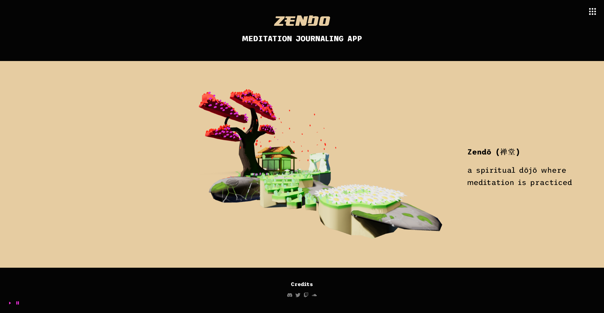

# Zendō
Zendō is a meditation journaling application where users can create an account and write in a daily journal their meditations. Each day has a different prompt, and users can create, read, update, and delete their entries.

## Technologies 
This is a MERN Stack (MongoDB, Express, React, Node.js) application. The web application is decoupled, so the server and the client are separate from each other. The server is hosted on Cyclic.sh, whereas the frontend is hosted on Render.com.

### NPM Packages
- Axios
- React
- React Icons
- React Toastify
- Redux
- Redux Toolkit
- Quill
- React-Quill
- Three.js
- R3F

## Demonstration

## Optimizations
Currently, the application only allows for local authentication. In the future, I will add OAuth2.0 authentication for Google or another provider that Zendō's users are more likely to use. 

## Credits
The web application is designed and developed by [@thomasjvu](https://github.com/thomasjvu). 

The music for this application is created by [@Peritune](https://www.youtube.com/@PeriTune).

The 3D model is created by [@itsmeAllenUwu](https://sketchfab.com/3d-models/meditation-diorama-a8e5d404631348aab2a64046f9aaf263)
